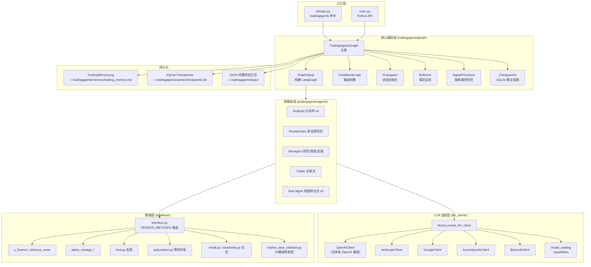
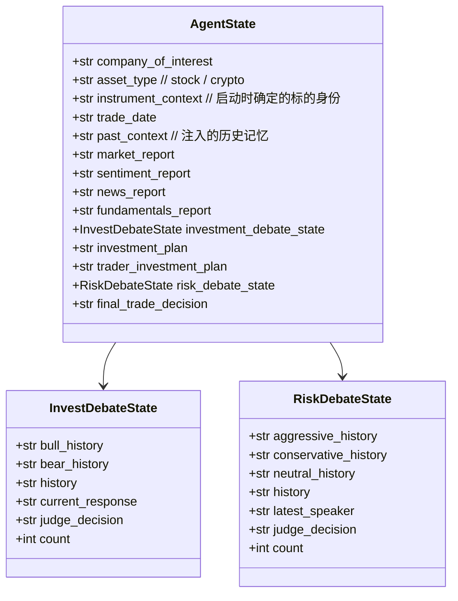
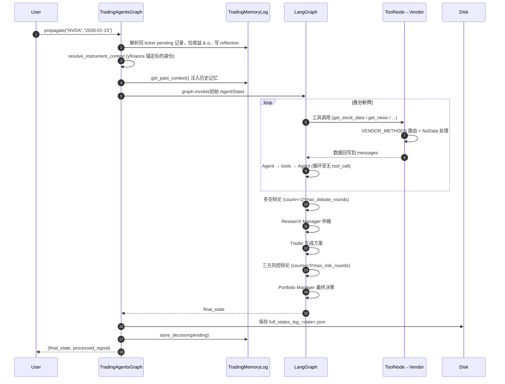

下面是对 `TradingAgents-main` 项目的完整结构分析、架构图与模块/配置梳理。

---

## 一、项目概览

**TradingAgents** 是一个基于 LangGraph 的**多智能体 LLM 金融交易框架**（v0.2.5），它通过模拟真实交易公司的角色分工（分析师、研究员、交易员、风控、投资组合经理），由多个 LLM Agent 协作完成对某只股票/加密资产的分析并给出交易决策。

| 维度      | 说明                                                                                                              |
| ------- | --------------------------------------------------------------------------------------------------------------- |
| 入口      | `main.py`（Python API）、`cli/main.py`（`tradingagents` 命令行）                                                        |
| 编排框架    | LangGraph (`StateGraph`) + LangChain                                                                            |
| 支持的 LLM | OpenAI、Anthropic、Google Gemini、xAI、DeepSeek、Qwen、GLM、MiniMax、OpenRouter、Azure、AWS Bedrock、Ollama、任意 OpenAI 兼容端点 |
| 数据源     | yfinance、Alpha Vantage、FRED、Polymarket、Reddit、StockTwits                                                        |
| 持久化     | 决策日志（Markdown）+ LangGraph SQLite 检查点                                                                            |
| 部署      | pip 安装 / Docker / docker-compose（含 Ollama profile）                                                              |

---

## 二、顶层目录结构

```
TradingAgents-main/
├── main.py                      # 编程入口示例
├── pyproject.toml               # 包定义（项目名/依赖/console_script）
├── requirements.txt
├── uv.lock
├── Dockerfile                   # 两阶段构建，非 root 用户
├── docker-compose.yml           # tradingagents + ollama 服务
├── .env.example / .env.enterprise.example
├── README.md / CHANGELOG.md / LICENSE
│
├── cli/                         # 交互式 CLI（typer + rich）
│   ├── main.py                  # `tradingagents` 命令实现（约 1300 行）
│   ├── utils.py                 # provider/ticker/语言等交互问询
│   ├── stats_handler.py         # LLM/工具调用统计回调
│   ├── announcements.py / config.py / models.py
│   └── static/
│
├── tradingagents/               # 核心包
│   ├── __init__.py              # 自动加载 .env 并消除已知告警
│   ├── default_config.py        # 全局默认配置 + TRADINGAGENTS_* 环境变量覆盖
│   ├── agents/                  # 所有智能体
│   ├── dataflows/               # 行情/新闻/宏观/预测市场 数据源适配
│   ├── graph/                   # LangGraph 编排
│   └── llm_clients/             # 多 LLM 提供商适配
│
├── scripts/
│   └── smoke_structured_output.py  # 结构化输出冒烟脚本
│
├── tests/                       # 40+ 个 pytest 用例（vendor/cli/structured/...）
├── assets/                      # README 用图片
└── .github/                     # CI/Issue 模板
```

---

## 三、项目架构图

### 1) 整体分层架构



### 2) LangGraph 工作流（Agent 协作流程）

```mermaid
flowchart LR
    START([START]) --> A1[Market Analyst]
    A1 -->|tool_calls| T1[tools_market] --> A1
    A1 -->|no tools| C1[Msg Clear Market] --> A2[Sentiment Analyst]

    A2 -->|tool_calls| T2[tools_social] --> A2
    A2 -->|no tools| C2[Msg Clear Sentiment] --> A3[News Analyst]

    A3 -->|tool_calls| T3[tools_news] --> A3
    A3 -->|no tools| C3[Msg Clear News] --> A4[Fundamentals Analyst]

    A4 -->|tool_calls| T4[tools_fundamentals] --> A4
    A4 -->|no tools| C4[Msg Clear Fundamentals] --> BULL

    BULL[Bull Researcher] <--> BEAR[Bear Researcher]
    BULL -->|count >= 2*max_rounds| RMG[Research Manager]
    BEAR -->|count >= 2*max_rounds| RMG

    RMG --> TRD[Trader 生成交易计划]
    TRD --> AG[Aggressive Analyst]
    AG <--> CV[Conservative Analyst]
    CV <--> NU[Neutral Analyst]
    AG -->|count >= 3*max_rounds| PMG[Portfolio Manager]
    CV -->|count >= 3*max_rounds| PMG
    NU -->|count >= 3*max_rounds| PMG

    PMG --> END([END<br/>final_trade_decision])
```



> 流程中每个分析师都遵循 **「Agent ↔ ToolNode」循环 + 消息清空** 的模式；研究员和风控辩论员通过 `count` 计数器控制轮次。

### 3) 状态对象 AgentState 关键字段



---

## 四、主要功能模块详解

### 1. `tradingagents/agents/` — 智能体（11 个角色）

| 子目录              | 文件                                                                         | 角色职责                                                                                                               |
| ---------------- | -------------------------------------------------------------------------- | ------------------------------------------------------------------------------------------------------------------ |
| **analysts/**    | `market_analyst.py`                                                        | 市场分析师：行情/K 线/指标，必须调用 `get_verified_market_snapshot` 锚定价格                                                           |
|                  | `fundamentals_analyst.py`                                                  | 基本面分析师：财报、资产负债、现金流、内部交易                                                                                            |
|                  | `news_analyst.py`                                                          | 新闻分析师：公司+宏观新闻、预测市场                                                                                                 |
|                  | `sentiment_analyst.py`                                                     | 情绪分析师：StockTwits/Reddit/新闻情绪（v0.2.5 grounded 版）                                                                    |
|                  | `social_media_analyst.py`                                                  | 旧名 alias（保留向后兼容）                                                                                                   |
| **researchers/** | `bull_researcher.py` / `bear_researcher.py`                                | 多空研究员，按 `max_debate_rounds` 进行结构化辩论                                                                                |
| **managers/**    | `research_manager.py`                                                      | 投资委员会主席：仲裁多空辩论，输出 `investment_plan`（结构化输出）                                                                         |
|                  | `portfolio_manager.py`                                                     | 投资组合经理：最终决策 Buy/Overweight/Hold/Underweight/Sell（结构化输出 + 记忆注入）                                                     |
| **trader/**      | `trader.py`                                                                | 交易员：把研究计划落地为 Buy/Hold/Sell 提案（结构化输出）                                                                               |
| **risk_mgmt/**   | `aggressive_debator.py` / `conservative_debator.py` / `neutral_debator.py` | 三方风控辩论员，按 `max_risk_discuss_rounds` 轮流发言                                                                           |
| **utils/**       | `agent_states.py`                                                          | `AgentState` / 两个 DebateState TypedDict                                                                            |
|                  | `agent_utils.py`                                                           | 工具暴露：`get_stock_data` / `get_news` / `get_fundamentals` / `get_macro_indicators` / `resolve_instrument_identity` 等 |
|                  | `memory.py`                                                                | `TradingMemoryLog` 追加式 Markdown 决策日志（pending → resolved）                                                           |
|                  | `structured.py`                                                            | Pydantic 结构化输出渲染回 Markdown                                                                                         |
|                  | `rating.py`                                                                | 5 档评级解析                                                                                                            |
|                  | `*_tools.py`                                                               | 按主题切分的 LangChain 工具集合                                                                                              |
| `schemas.py`     | —                                                                          | Pydantic 决策 schema（`PortfolioRating`、`TraderAction`、`ResearchPlan` 等）                                              |

### 2. `tradingagents/graph/` — 编排核心

| 文件                     | 作用                                                                                                                   |
| ---------------------- | -------------------------------------------------------------------------------------------------------------------- |
| `trading_graph.py`     | **`TradingAgentsGraph` 主入口**：初始化 LLM、记忆、检查点、调用 `propagate()` 跑完整流水线，并自动 `_resolve_pending_entries`（拉取实现收益 + α，写入反思）。 |
| `setup.py`             | `GraphSetup` 用 LangGraph `StateGraph` 把所有 Agent 节点连线（即上方流程图）。                                                        |
| `conditional_logic.py` | 路由判断（是否调用工具、辩论是否结束）。                                                                                                 |
| `propagation.py`       | `Propagator.create_initial_state()` 构造初始状态，含 `past_context`、`instrument_context`。                                    |
| `analyst_execution.py` | 分析师执行计划构建（顺序/并发） + wall-time tracker。                                                                                |
| `reflection.py`        | `Reflector.reflect_on_final_decision()` 事后 2–4 句反思。                                                                  |
| `signal_processing.py` | 从最终决策文本抽取核心 Buy/Hold/Sell 信号。                                                                                        |
| `checkpointer.py`      | 基于 `langgraph-checkpoint-sqlite` 的 per-ticker 断点 (`<TICKER>.db`)。                                                    |

### 3. `tradingagents/dataflows/` — 数据源抽象

* **`interface.py`**：核心路由表 `VENDOR_METHODS`，按 `data_vendors` / `tool_vendors` 配置选择 vendor，**严格不静默回退**到未配置的 vendor（v0.2.5 关键改进）。当所有 vendor 都没数据时统一返回 `NO_DATA_AVAILABLE:` 哨兵字符串，避免 LLM 编造数值。
* **`config.py`** + `set_config()` / `get_config()`：全局配置存取。
* **`errors.py`**：`NoMarketDataError` / `VendorRateLimitError` / `VendorNotConfiguredError` 三类语义化异常。
* 行情/基本面：`y_finance.py`、`alpha_vantage_*`
* 新闻：`yfinance_news.py`、`alpha_vantage_news.py`、`reddit.py`、`stocktwits.py`
* 宏观：`fred.py`（FRED API）
* 预测市场：`polymarket.py`
* 工具：`symbol_utils.py`（多市场代码标准化）、`market_data_validator.py`（价格快照核验，防 LLM 虚构）、`stockstats_utils.py`（技术指标）、`utils.py`（含 `safe_ticker_component` 防路径穿越）

### 4. `tradingagents/llm_clients/` — LLM 多厂商适配

| 文件                    | 作用                                                                                                                  |
| --------------------- | ------------------------------------------------------------------------------------------------------------------- |
| `factory.py`          | `create_llm_client(provider, model, base_url, **kwargs)` 工厂，按 provider 字符串懒加载对应 SDK。                                |
| `base_client.py`      | 抽象基类 `BaseLLMClient` 提供统一 `get_llm()` 接口。                                                                           |
| `openai_client.py`    | OpenAI + 所有 OpenAI 兼容（xAI、DeepSeek、Qwen 国内/国际、GLM、MiniMax、OpenRouter、Moonshot、Mistral、Groq、NVIDIA、vLLM/LM Studio…）。 |
| `anthropic_client.py` | Claude 系列（含 `effort` 控制）。                                                                                           |
| `google_client.py`    | Gemini（含 `thinking_level`）。                                                                                         |
| `azure_client.py`     | Azure OpenAI（读取 `.env.enterprise`）。                                                                                 |
| `bedrock_client.py`   | AWS Bedrock（可选依赖 `[bedrock]`，AWS SigV4）。                                                                            |
| `model_catalog.py`    | 各 provider 默认/推荐 deep/quick 模型清单（CLI 下拉用）。                                                                          |
| `capabilities.py`     | 模型能力探测（是否支持 reasoning、structured output、temperature 等）。                                                             |
| `api_key_env.py`      | 每个 provider 对应的环境变量名映射。                                                                                             |
| `validators.py`       | 模型 ID 校验。                                                                                                           |

### 5. `cli/` — 交互式命令行

* `cli/main.py` — `typer` 应用，命令包括 `analyze`、`--checkpoint`、`--clear-checkpoints` 等；用 `rich.Live` 渲染实时报告面板。
* `cli/utils.py` — 一系列 `select_*` / `ask_*` 交互函数：选 provider、ticker、深度、语言、reasoning effort 等。
* `cli/stats_handler.py` — LangChain `BaseCallbackHandler`，统计每次 LLM/工具调用耗时和 token 数。

### 6. `tests/` — 测试

40+ 个 pytest 模块，覆盖：vendor 路由 (`test_vendor_routing/errors`)、CLI ticker/语言、provider 注册、记忆日志、断点续跑、结构化输出、新闻 look-ahead 防护、temperature 配置、symbol normalization 等。`pyproject.toml` 配置了 `unit/integration/smoke` 三个 marker。

### 7. 数据源配置

| 数据源                         | 类别(category)                                                          | 接入方式                                      | 是否需要 Key                | 说明                                    |
| --------------------------- | --------------------------------------------------------------------- | ----------------------------------------- | ----------------------- | ------------------------------------- |
| **yfinance**（Yahoo Finance） | core_stock_apis / technical_indicators / fundamental_data / news_data | `interface.route_to_vendor` 路由（默认 vendor） | 否                       | 行情、技术指标、财报、新闻全覆盖                      |
| **Alpha Vantage**           | core_stock_apis / technical_indicators / fundamental_data / news_data | 同上（可选 vendor）                             | `ALPHA_VANTAGE_API_KEY` | yfinance 的替代/备选 vendor                |
| **FRED**（美联储经济数据）           | macro_data                                                            | `route_to_vendor`                         | `FRED_API_KEY`          | 宏观指标（CPI、利率、就业、收益率曲线等）                |
| **Polymarket**              | prediction_markets                                                    | `route_to_vendor`                         | 否（keyless）              | 预测市场的事件隐含概率                           |
| **StockTwits**              | （社交情绪，未走 vendor 路由）                                                   | `dataflows/stocktwits.py` 直连 API          | 否                       | 散户社交情绪（带 Bullish/Bearish 标签）          |
| **Reddit**                  | （社交情绪，未走 vendor 路由）                                                   | `dataflows/reddit.py` 直连 RSS              | 否                       | r/wallstreetbets、r/stocks、r/investing |


角色 × 数据源 速查矩阵

| 角色 \ 数据源            | yfinance    | Alpha Vantage | FRED  | Polymarket | StockTwits | Reddit |
| ------------------- | ----------- | ------------- | ----- | ---------- | ---------- | ------ |
| 市场分析师 Market        | ✅(行情/指标/快照) | ✅(行情/指标)      | —     | —          | —          | —      |
| 基本面分析师 Fundamentals | ✅(财报)       | ✅(财报)         | —     | —          | —          | —      |
| 新闻分析师 News          | ✅(新闻)       | ✅(新闻)         | ✅(宏观) | ✅(事件概率)    | —          | —      |
| 情绪分析师 Sentiment     | ✅(新闻头条)     | ✅(新闻头条)       | —     | —          | ✅          | ✅      |
| 多头/空头研究员            | —           | —             | —     | —          | —          | —      |
| 研究经理 / 投组经理         | —           | —             | —     | —          | —          | —      |
| 交易员 Trader          | —           | —             | —     | —          | —          | —      |
| 三方风控辩论员             | —           | —             | —     | —          | —          | —      |

> ✅ 表示该角色实际会触达该数据源；标 yfinance/Alpha Vantage 同列打勾是因为两者为**可互换的 vendor**（由 `data_vendors` 配置决定实际走哪个，默认 yfinance）。


中国数据源： 

情绪用雪球，东方财富股吧

akshare

---

## 五、关键配置

### 1. `tradingagents/default_config.py` — 全局默认值

| 配置键                                                                      | 默认值                                         | 说明                                       |
| ------------------------------------------------------------------------ | ------------------------------------------- | ---------------------------------------- |
| `llm_provider`                                                           | `"openai"`                                  | LLM 厂商                                   |
| `deep_think_llm`                                                         | `"gpt-5.5"`                                 | 用于研究经理、投资组合经理等深度思考节点                     |
| `quick_think_llm`                                                        | `"gpt-5.4-mini"`                            | 用于分析师、辩论员等快速节点                           |
| `backend_url`                                                            | `None`                                      | 自定义 OpenAI 兼容端点（vLLM/LM Studio/...）      |
| `google_thinking_level` / `openai_reasoning_effort` / `anthropic_effort` | `None`                                      | 各 provider 的思考强度                         |
| `temperature`                                                            | `None`                                      | 采样温度，跨 provider 透传                       |
| `output_language`                                                        | `"English"`                                 | 报告输出语言（辩论始终用英文）                          |
| `max_debate_rounds`                                                      | `1`                                         | 多空辩论轮数                                   |
| `max_risk_discuss_rounds`                                                | `1`                                         | 风控辩论轮数                                   |
| `max_recur_limit`                                                        | `100`                                       | LangGraph 递归上限                           |
| `analyst_concurrency_limit`                                              | `1`                                         | 分析师并发度                                   |
| `checkpoint_enabled`                                                     | `False`                                     | 是否启用 SQLite 断点续跑                         |
| `news_article_limit`                                                     | `20`                                        | 单 ticker 新闻最大条数                          |
| `global_news_article_limit`                                              | `10`                                        | 宏观新闻最大条数                                 |
| `global_news_lookback_days`                                              | `7`                                         | 宏观新闻回看窗口                                 |
| `global_news_queries`                                                    | 5 条预置查询                                     | 美联储/标普/地缘/全球央行/能源                        |
| `data_vendors`                                                           | yfinance + fred + polymarket                | 各数据类别的 vendor 链                          |
| `tool_vendors`                                                           | `{}`                                        | 工具级 vendor 覆盖（优先于 category）              |
| `benchmark_ticker`                                                       | `None`                                      | α 计算基准（覆盖 map）                           |
| `benchmark_map`                                                          | 多市场 → 指数映射                                  | US→SPY，HK→^HSI，T→^N225，L→^FTSE，SS→上证综指 等 |
| `results_dir`                                                            | `~/.tradingagents/logs`                     | 完整状态 JSON 输出                             |
| `data_cache_dir`                                                         | `~/.tradingagents/cache`                    | 缓存 + 检查点                                 |
| `memory_log_path`                                                        | `~/.tradingagents/memory/trading_memory.md` | 决策日志                                     |
| `memory_log_max_entries`                                                 | `None`                                      | 已解析记录上限（pending 不计）                      |

### 2. `TRADINGAGENTS_*` 环境变量覆盖

`default_config._ENV_OVERRIDES` 提供唯一映射表（无需改代码）：

```
TRADINGAGENTS_LLM_PROVIDER       -> llm_provider
TRADINGAGENTS_DEEP_THINK_LLM     -> deep_think_llm
TRADINGAGENTS_QUICK_THINK_LLM    -> quick_think_llm
TRADINGAGENTS_LLM_BACKEND_URL    -> backend_url
TRADINGAGENTS_OUTPUT_LANGUAGE    -> output_language
TRADINGAGENTS_MAX_DEBATE_ROUNDS  -> max_debate_rounds
TRADINGAGENTS_MAX_RISK_ROUNDS    -> max_risk_discuss_rounds
TRADINGAGENTS_CHECKPOINT_ENABLED -> checkpoint_enabled
TRADINGAGENTS_BENCHMARK_TICKER   -> benchmark_ticker
TRADINGAGENTS_TEMPERATURE        -> temperature
```

类型按既有默认值自动强转（bool/int/float/str）。另外 `TRADINGAGENTS_RESULTS_DIR` / `TRADINGAGENTS_CACHE_DIR` / `TRADINGAGENTS_MEMORY_LOG_PATH` / `OLLAMA_BASE_URL` 直接读自 `os.getenv`。

### 3. API Key 环境变量（`.env.example`）

OPENAI / GOOGLE / ANTHROPIC / XAI / DEEPSEEK / DASHSCOPE(_CN) / ZHIPU(_CN) / MINIMAX(_CN) / OPENROUTER / MISTRAL / MOONSHOT / GROQ / NVIDIA / FRED / ALPHA_VANTAGE / OPENAI_COMPATIBLE / AWS（用于 Bedrock）。

### 4. `pyproject.toml` 关键项

* `requires-python = ">=3.10"`
* 控制台脚本：`tradingagents = cli.main:app`
* 可选依赖：`[dev]`（ruff + pytest）、`[bedrock]`（langchain-aws）
* Ruff lint 集：`E/W/F/I/B/UP/C4/SIM`，忽略 `E501`
* Pytest markers：`unit / integration / smoke`

### 5. Docker

* `Dockerfile` 两阶段构建，运行时使用非 root `appuser`，挂载 `/home/appuser/.tradingagents`。
* `docker-compose.yml` 两个服务：默认 `tradingagents`；通过 `--profile ollama` 启动 `tradingagents-ollama` + `ollama` 双容器。

---

## 六、运行时数据流（简版时序）



---

## 七、亮点设计总结

1. **角色化多智能体辩论**：分析师 → 多空研究员 → 研究经理 → 交易员 → 三方风控辩论 → 投资组合经理，全程贯穿 `AgentState`。
2. **vendor 严格路由**：用户配置的 vendor 链即为执行链，绝不静默回退到未选 vendor，错误统一为 `NO_DATA_AVAILABLE:` 哨兵字符串，杜绝 LLM 编造数据。
3. **deterministic 锚点**：`resolve_instrument_identity` 在 run 启动时锁定公司身份；`get_verified_market_snapshot` 强制分析师锚定真实价格。
4. **多语言、多市场、多 provider 全覆盖**：US/HK/JP/UK/IN/CA/AU/SH/SZ/Crypto + 14 种 LLM provider，且每个 provider 的 reasoning effort/thinking level/temperature 都可调。
5. **可恢复 / 可复盘**：opt-in 的 LangGraph SQLite 检查点；持久化决策日志在下次同 ticker 运行时自动算 α 并生成反思，反哺投资组合经理 prompt。
6. **可配置性**：`TRADINGAGENTS_*` 环境变量 + `.env` 直接驱动配置，无需改代码即可切 LLM/模型/端点。
7. **结构化输出 + Markdown 回渲染**：决策类 Agent 用各 provider 原生 structured output，再统一渲染回 Markdown，下游展示/日志无须修改。

如需进一步深入某个模块（例如把 `agent_utils.py` 的工具暴露逻辑、`schemas.py` 的全部 Pydantic 模型、或者 CLI 中 provider 选择树展开），告诉我具体方向即可。
