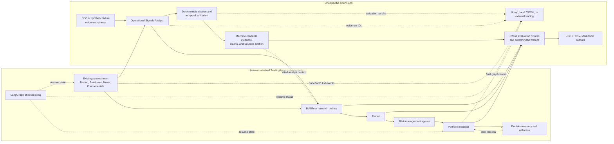

# Fork Extension Architecture

This document separates the upstream-derived TradingAgents workflow from the
features added in this fork.

## Key decisions

### Extend the existing graph metadata

`operational` is another `AnalystNodeSpec`, analyst factory, conditional route,
and ToolNode. It therefore inherits analyst ordering, wall-time tracking,
message clearing, checkpoint signatures, and downstream handoff. A second
orchestrator would have duplicated those behaviors and made resume semantics
ambiguous.

### Provider-owned evidence, model-owned synthesis

Retrieval code creates evidence records and stable IDs. The LLM sees only
date-valid records and chooses among their exact IDs. It cannot create URLs or
rewrite evidence metadata. Deterministic code validates the final relationships
and labels unsupported or conflicting claims.

### Source identity drives citation identity

Stable IDs hash ticker, source URL/title, public dates, and reporting period,
not retrieval time. Re-fetching a source yields the same citation ID. Duplicate
records from the same document consolidate while retaining multiple claim
categories in metadata.

### Strict dates over apparent completeness

Unknown public dates are rejected in strict mode. This can reduce apparent
coverage, but it avoids treating current pages or period-end columns as proof
that information existed during a historical run.

### Local observability in the base install

JSONL tracing depends only on the base package. External tracing uses
LangSmith's native LangChain/LangGraph integration behind an optional extra.
Content capture remains opt-in and all records are redacted.

### Separate deterministic and subjective evaluation

Offline structural metrics run in CI. Model-assisted judgments require an
explicit provider and retain model/version/rubric/raw scores. Neither category
is framed as evidence of profitable trading.
