# RFC: Auto-Research Loop for Intraday Prediction

> **Status:** Draft — seeking feedback
> **Scope:** Additive module (no changes to existing files)
> **Related:** [ARCHITECTURE_OVERVIEW.md](./ARCHITECTURE_OVERVIEW.md)

## TL;DR

Add a `tradingagents/autoresearch/` module that runs walk-forward backtesting
on the existing `TradingAgentsGraph`, using the existing `reflect_and_remember()`
memory system to iteratively improve intraday predictions. No existing files
are modified.

## The Core Idea

Apply Andrew Karpathy-style iterative research methodology to the existing TradingAgents architecture:

> **Take historical data → Predict next day → Check if right → Learn from mistakes → Predict again → Repeat**

This is essentially **walk-forward backtesting with self-improvement** — a proven concept in quantitative finance, now powered by LLM agents instead of traditional ML models.

---

## Design Tradeoffs

### Strengths of this approach

| Aspect | Why it works |
|---|---|
| **We already have the agents** | TradingAgents already does single-day analysis. We're just running it repeatedly |
| **We already have the data pipeline** | yfinance gives us free historical data — no new APIs needed |
| **Walk-forward is proven** | This is how quant funds actually test strategies |
| **Memory system exists** | `reflect_and_remember()` already learns from past trades |
| **Iterative learning** | Each wrong prediction improves the next one via memory |

### Risks requiring careful design

| Risk | Mitigation |
|---|---|
| **LLM API costs** | Each day = ~12 agent calls with LLM. 30 days = 360+ LLM calls. Reuse existing `quick_think_llm` (currently `gpt-5.4-mini` in `default_config.py`) for cheap agents; only use `deep_think_llm` where reasoning depth is required |
| **Overfitting to past data** | Don't tune prompts to specific dates — tune the APPROACH (which tools matter, what indicators to prioritize) |
| **Look-ahead bias** | When predicting day 11, the agents must ONLY see data up to day 10. Never leak future data |
| **Rate limits** | yfinance and Alpha Vantage have limits. Add delays between runs |
| **What "change everything" means** | Don't change model weights (we can't). Change: which analysts to use, debate rounds, indicator selection, prompt emphasis |

### Key design decision: no same-day retries

**Alternative considered:** If a prediction is wrong, retry the same day with a different approach.

**Rejected because:** Retrying the same day with knowledge of the actual outcome introduces look-ahead bias, which invalidates backtesting results.

**Recommended approach:** Move forward only — let memory accumulate lessons naturally.
1. Predict day 11 → Wrong → **Reflect and store lesson in memory**
2. Move to day 12 with the lesson learned
3. The memory system naturally improves future predictions
4. After all 30 days, analyze WHICH types of predictions failed and WHY

Rationale:
- Retrying the same day with knowledge of the answer is look-ahead bias
- The existing memory system already handles "learning from mistakes"
- The approach (not individual predictions) is what should be tuned

---

## How It Maps to Existing Architecture

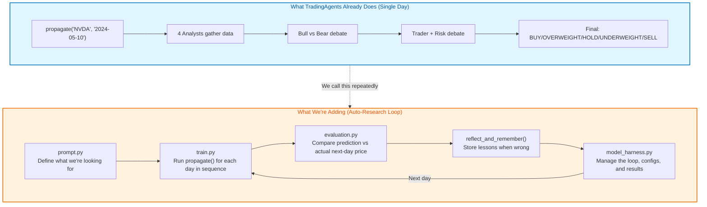

---

## Time Horizon Configuration

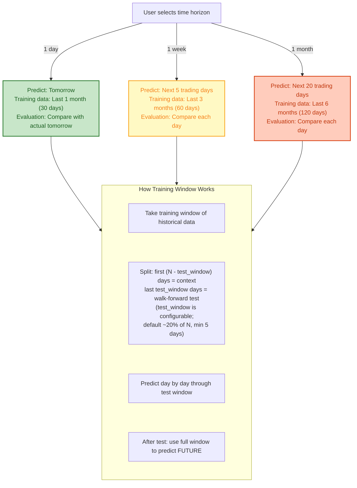

---

## Complete Auto-Research Pipeline

```mermaid
%%{init: {'flowchart': {'nodeSpacing': 80, 'rankSpacing': 120}}}%%
flowchart TD
    subgraph SETUP["Phase 1: Setup"]
        S1["User inputs:<br/>- Ticker (e.g., NVDA)<br/>- Time horizon (1 day / 1 week / 1 month)<br/>- Start date"]
        S2["prompt.py<br/>Define analysis focus:<br/>- What indicators matter?<br/>- What news to prioritize?<br/>- Risk tolerance?"]
        S3["model_harness.py<br/>Load config + initialize TradingAgentsGraph"]
        S1 --> S3
        S2 --> S3
    end

    subgraph TRAIN["Phase 2: Walk-Forward Training (train.py)"]
        T1["Load training window<br/>(e.g., 30 days for 1-day horizon)"]
        T2["Day 1-20: Historical context<br/>(agents can see this data)"]
        T3["Day 21: First prediction target"]

        T4["Run propagate(ticker, day_20)<br/>Get prediction for day 21"]
        T5["evaluation.py:<br/>Compare prediction vs actual day 21"]

        T6{"Prediction<br/>correct?"}
        T7["reflect_and_remember(positive_return)<br/>Store: what worked"]
        T8["reflect_and_remember(negative_return)<br/>Store: what went wrong + why"]

        T9["Slide window: Add day 21 to context<br/>Now predict day 22"]

        T1 --> T2 --> T3 --> T4 --> T5 --> T6
        T6 -->|"Yes"| T7
        T6 -->|"No"| T8
        T7 --> T9
        T8 --> T9
        T9 -->|"Repeat for days 22-30"| T4
    end

    subgraph EVAL["Phase 3: Evaluation Summary (evaluation.py)"]
        EV1["Accuracy: X/10 days predicted correctly"]
        EV2["Direction accuracy: Did we get UP/DOWN right?"]
        EV3["Magnitude: How close was the prediction?"]
        EV4["Best/worst performing indicators"]
        EV5["Save results to Excel/CSV"]
    end

    subgraph PREDICT["Phase 4: Future Prediction"]
        P1["Use full 30-day window + learned memories"]
        P2["Predict next 10-30 days (based on horizon)"]
        P3["Save predictions to Excel"]
    end

    subgraph VIZ["Phase 5: Visualization"]
        V1["Left chart: Actual price history"]
        V2["Right chart: Predicted prices"]
        V3["Overlay: Where predictions matched/diverged"]
        V4["Metrics dashboard: accuracy, returns, etc."]
    end

    S3 --> T1
    T9 -->|"After all training days"| EV1
    EV1 --> EV2 --> EV3 --> EV4 --> EV5
    EV5 --> P1 --> P2 --> P3
    P3 --> V1
    V1 --> V2 --> V3 --> V4

    %% FIXED STYLES (dark text + stronger borders)
    style SETUP fill:#e1f5fe,stroke:#0277bd,stroke-width:2px,color:#01579b
    style TRAIN fill:#fff3e0,stroke:#ef6c00,stroke-width:2px,color:#e65100
    style EVAL fill:#e8f5e9,stroke:#2e7d32,stroke-width:2px,color:#1b5e20
    style PREDICT fill:#fce4ec,stroke:#c2185b,stroke-width:2px,color:#880e4f
    style VIZ fill:#f3e5f5,stroke:#6a1b9a,stroke-width:2px,color:#4a148c
```

---

## File Structure for the PR

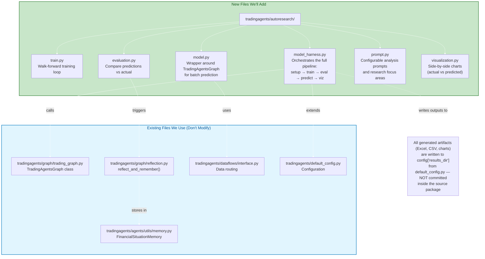

---

## Detailed: train.py Logic

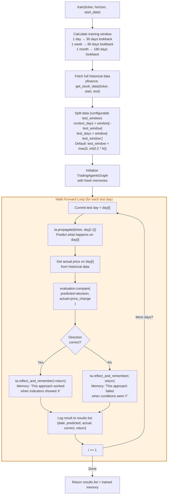

---

## Detailed: evaluation.py Logic

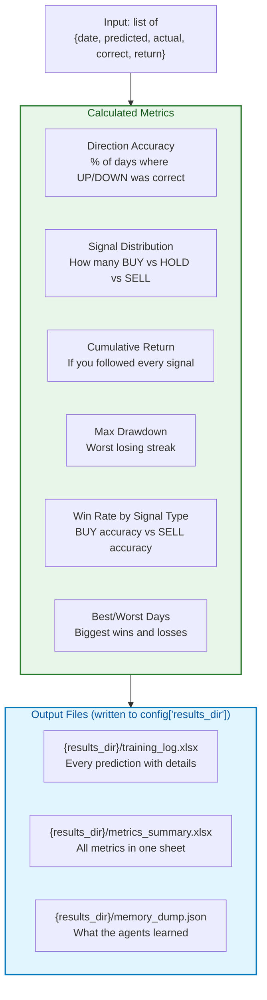

---

## Detailed: visualization.py Layout

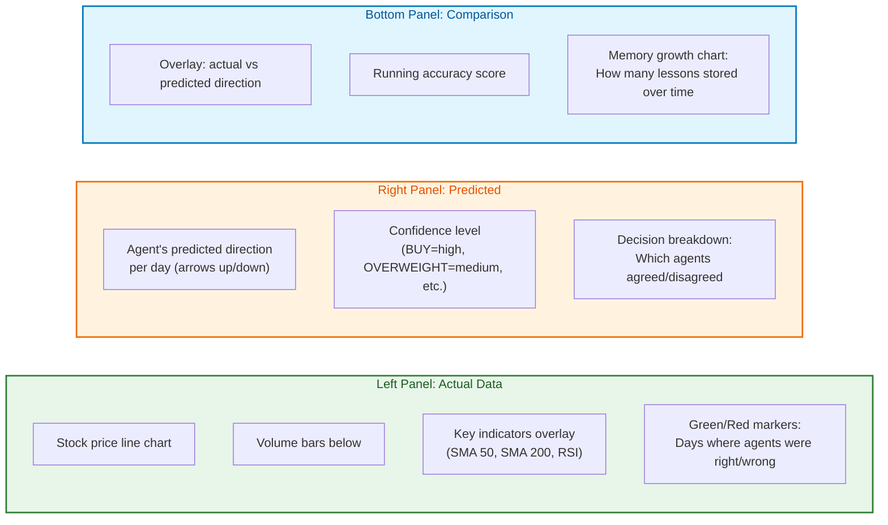

---

## Detailed: model_harness.py (The Orchestrator)

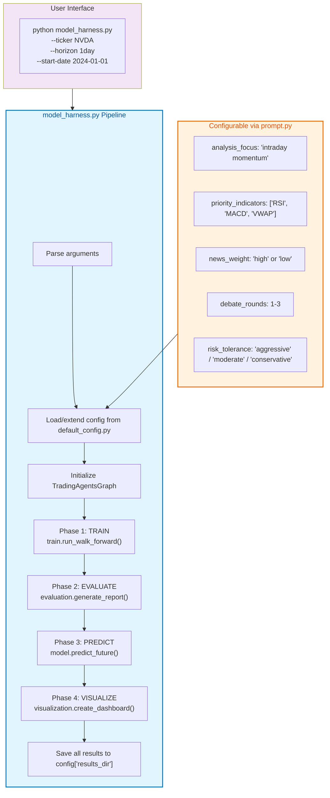

---

## How prompt.py Works

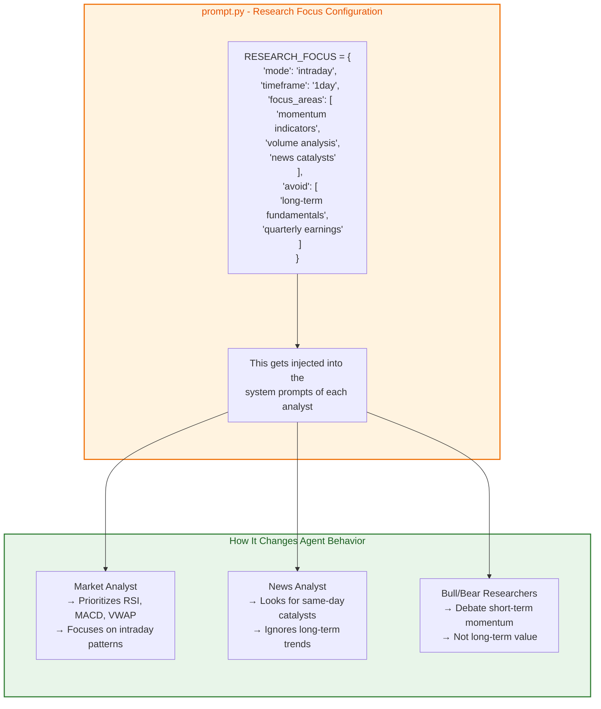

---

## Walk-Forward Example: 1-Day Horizon with NVDA

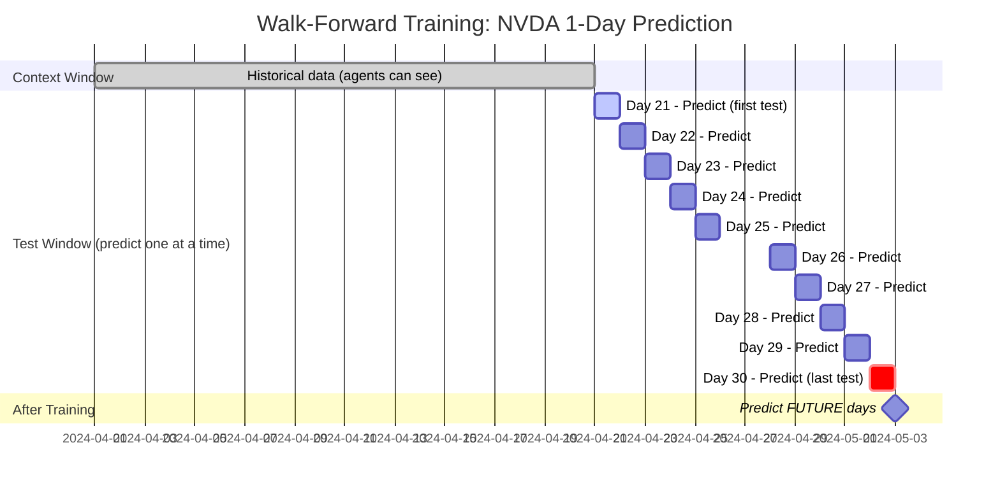

**Step-by-step for Day 21:**
1. Agents see data from Apr 1-20 only
2. `ta.propagate("NVDA", "2024-04-20")` → Predicts direction for Apr 21
3. Check actual Apr 21 price: Was prediction right?
4. `ta.reflect_and_remember(actual_return)` → Store lesson
5. Now agents see Apr 1-21 → Predict Apr 22
6. Repeat...

---

## What "Adjusting the Approach" Actually Means

When a prediction is wrong, here's what safely adjusts vs. what must remain fixed:

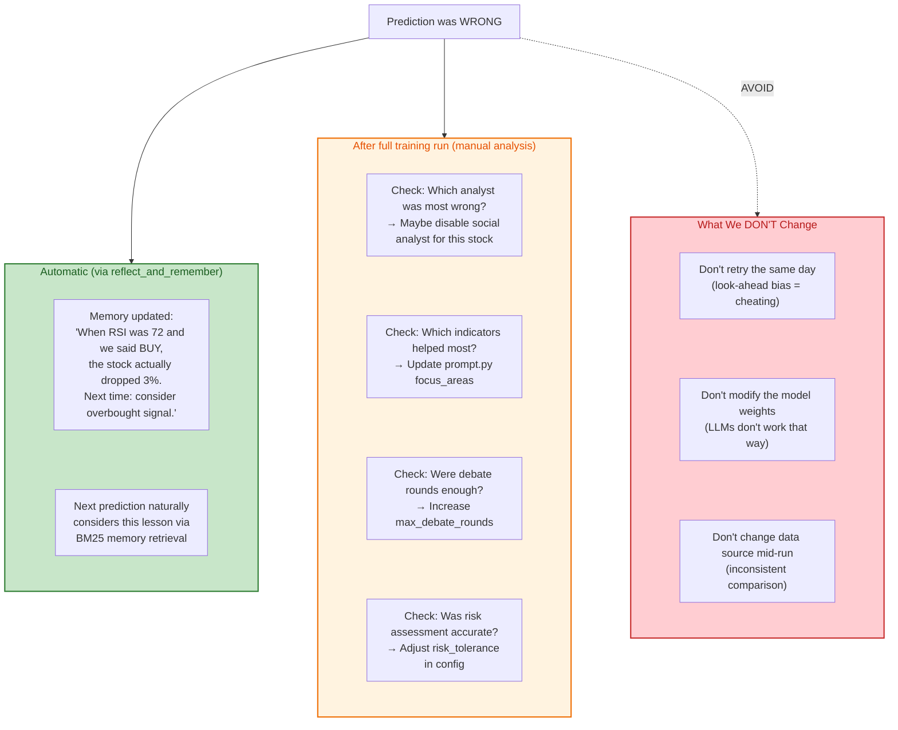

---

## Summary: What We're Building

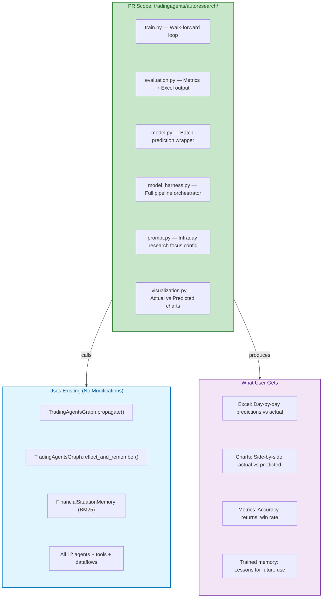

---

## Key Design Decisions

| Decision | Choice | Why |
|---|---|---|
| Retry same day on failure? | **No** — move forward, learn via memory | Retrying with answer knowledge = look-ahead bias |
| Modify existing agent code? | **No** — only ADD new files | Clean PR, no risk of breaking existing functionality |
| Where does learning happen? | **reflect_and_remember()** — already built | Don't reinvent the wheel |
| How to tune approach? | **prompt.py** config + post-training analysis | Separates "what to focus on" from "how it runs" |
| Output format? | **Excel + matplotlib charts** | Simple, shareable, no extra dependencies |
| Max prediction horizon? | **1 month (not 1 year)** | LLM-based analysis degrades over long horizons |

---

## Questions for Reviewers

1. **Is the approach sound?** Walk-forward backtesting with memory-based learning vs. alternative approaches the team might prefer?
2. **Module location** — `tradingagents/autoresearch/` OK, or better under `experiments/` or `research/`?
3. **API cost concern** — Training over 30 days = ~360 LLM calls. Is this acceptable, or should the design include batch/cheap-model modes?
4. **Scope** — Start with just `1day` horizon, or all three (`1day`/`1week`/`1month`) in the first iteration?
5. **Merged feature or experimental branch?** — Should this live in `main` or as a separate experimental track?

## Next Steps

If the approach is approved, a follow-up PR will implement the actual module according to the design above. This RFC is intentionally docs-only to gather feedback before implementation.
